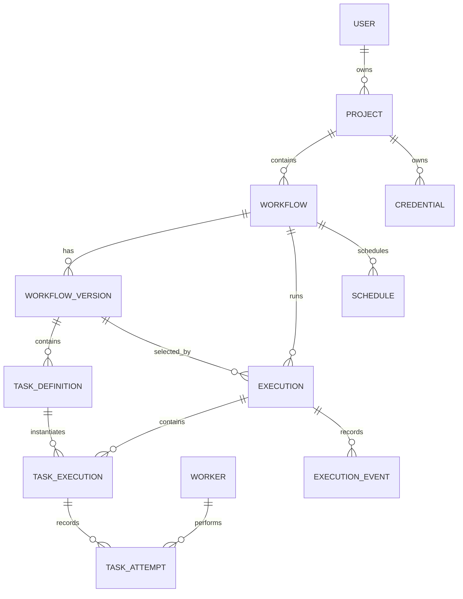

# Data Model

PostgreSQL is the authoritative store for control-plane state. IDs are opaque identifiers. All project-owned records carry `project_id` directly or through a parent relation so authorization and deletion checks can be enforced in queries.

## Entities

- **User:** authenticated identity, status, and timestamps. Owns projects.
- **Project:** isolation boundary, owner, name, status, and timestamps.
- **Workflow:** logical identity, project, name, description, status, and active version reference.
- **WorkflowVersion:** immutable published snapshot with monotonically increasing version number, trigger definition, task graph, policies, creator, and timestamp.
- **TaskDefinition:** node inside a version; stable node key, type, configuration, dependency keys, retry policy, timeout, and input/output mapping.
- **Execution:** one invocation; project, workflow, exact version, trigger source, input/artifact references, status, timestamps, failure summary, and idempotency key.
- **TaskExecution:** one logical task within an execution; task key, status, current attempt, lease summary, output/artifact references, and timestamps.
- **TaskAttempt:** append-only attempt record; number, worker, status, lease token/version, start/end times, failure classification, output reference, and termination reason.
- **Worker:** service identity, status, capabilities, software version, last heartbeat, and timestamps.
- **Schedule:** project/workflow reference, expression, timezone, enabled state, next occurrence, and occurrence/idempotency metadata.
- **Credential:** project-scoped secret reference and type metadata. Secret values are held by a secret provider, not ordinary rows or APIs.
- **ExecutionEvent:** immutable lifecycle event with project, execution/task/attempt/worker identifiers where applicable, event type, timestamp, and redacted metadata.
- **LogEntry:** structured log with the same correlation identifiers, severity, source, timestamp, and redacted message/fields.

## Relationships and invariants

A workflow version cannot change after publication. An execution always points to one version, and task executions point to task definitions in that version. Attempt numbers are unique within a task execution. At most one current valid lease exists for an attempt; lease renewal and result persistence are conditional on the lease token/version. Event and attempt history is append-only.

Execution state is current-state columns plus append-only history; this is not full event sourcing. JSON is appropriate for task configuration and small payloads, while large inputs/outputs use object-storage references with content metadata and retention policy.

## Lifecycle states

Workflow: `draft`, `active`, `paused`, `archived`.

Execution: `pending`, `running`, `completed`, `failed`, `cancel_requested`, `cancelled`, `timed_out`.

Task execution: `pending`, `queued`, `leased`, `running`, `succeeded`, `failed`, `retry_scheduled`, `timed_out`, `cancel_requested`, `cancelled`, `blocked`.

Worker: `starting`, `healthy`, `busy`, `stopping`, `offline`.

Terminal states are guarded against arbitrary transitions. Recovery and retries create a new attempt rather than mutating historical outcomes.
