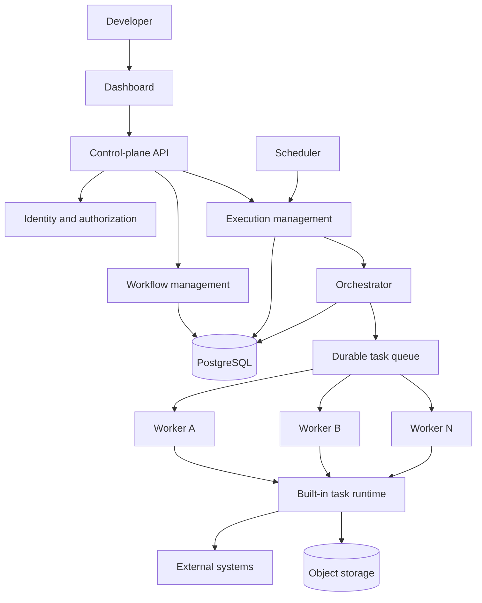
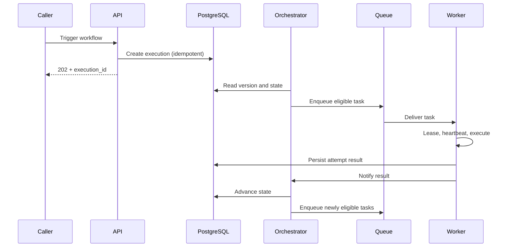

# FlowForge System Design

## 1. Purpose and Product Scope

FlowForge is a developer-focused workflow orchestration platform. A user defines a versioned directed acyclic graph (DAG) of tasks, triggers an execution, and receives durable status, history, logs, and failure information. FlowForge performs the work asynchronously through a PostgreSQL-backed queue and independently running workers.

The product's differentiator is reliable distributed execution, not a large catalog of integrations or a no-code editor.

### Goals

- Execute versioned workflows asynchronously.
- Resolve dependencies and run independent tasks concurrently.
- Persist execution state and attempt history.
- Recover work after worker failure using leases and heartbeats.
- Provide retries, timeouts, cancellation, scheduling, webhooks, and observability.
- Keep task implementations behind a stable task contract.

### Non-goals

FlowForge does not aim to include enterprise SSO, advanced RBAC, multi-region operation, Kubernetes orchestration, billing, a marketplace, dynamic third-party plugins, or exactly-once guarantees. It does not provide a broad integration catalog; task types are a small, stable, built-in set. These are deliberate boundaries, not pending features.

## 2. Users and Ownership

The user is an authenticated developer or operator. A `User` owns one or more `Project` records. A project is the isolation boundary for workflows, versions, executions, schedules, credentials, logs, and artifacts. Projects use a single-owner model; collaborators, invitations, and roles are not implemented.

Every control-plane request carries a user identity. Authorization checks the resource's project ownership before reading or mutating it. Workers are service principals, not project users; they authenticate separately and receive only the task data and credential references needed for an assigned attempt.

## 3. Scope

**Implemented functionality:** project ownership, workflow drafts, validation, immutable published versions, manual/API/webhook/scheduled triggers, execution status and history, cancellation, logs, an execution dashboard, version comparison, an advisory workflow review, and AI-assisted authoring.

**Backend functionality:** Go control-plane services backed by PostgreSQL, a durable queue, an orchestrator, a scheduler, worker registration, built-in HTTP/Transform/Delay/Conditional/Email task types, artifact references, and structured operational APIs.

**Distributed-systems functionality:** multiple workers, concurrent DAG execution, durable state, at-least-once delivery, task attempts, leases, heartbeats, timeouts, retry/backoff, worker failure detection and recovery, idempotency keys, and execution history.

**Out of scope:** collaboration, dynamic plugins, advanced quotas/priorities, enterprise identity, multi-region deployment, billing, and a broad integration marketplace. These do not strengthen the core failure-recovery demonstration.

## 4. Architecture

FlowForge has a **control plane** and an **execution plane**. The control plane decides what should happen and persists authoritative state. The execution plane obtains queued tasks and performs them. The API never executes workflow tasks directly.

### Component responsibilities

- **API/control plane:** authentication, authorization, validation, resource APIs, and immediate execution acknowledgement.
- **Workflow management:** drafts, DAG validation, publishing, activation, and immutable versions.
- **Execution management:** execution records, cancellation requests, query projections, and lifecycle coordination.
- **Orchestrator:** evaluates persisted state, schedules eligible tasks, handles results, retries, and terminal transitions. It never runs task code.
- **Scheduler:** detects due schedules and submits idempotent execution requests through the normal execution path.
- **Queue:** durable buffering and delivery between orchestrator and workers, implemented in PostgreSQL.
- **Workers:** authenticate, register capabilities, lease tasks, heartbeat, execute task types, and report results.
- **Task runtime:** validates configuration and executes a specific built-in task contract.
- **PostgreSQL:** source of truth for definitions, state, attempts, leases, schedules, identities, and audit history.
- **Object storage:** stores large payloads and artifacts; database and queue carry references, not large binaries.

## 5. Request and Execution Flows

Control operations are synchronous and short-lived. A trigger authenticates and authorizes the caller, validates the selected active version and input, creates an execution record, and returns an execution ID. The request does not wait for task completion.

For a DAG, a task is eligible only when all required predecessors succeeded. Independent tasks may be queued together and leased by different workers. A downstream task runs only after all required predecessors reach success; a failed predecessor blocks dependents.

If a worker stops heartbeating, its lease expires. Recovery marks the attempt as worker-lost and makes the task eligible for a new attempt according to policy. The result is at-least-once execution: a task may run more than once when completion is ambiguous. Side-effecting tasks receive a deterministic idempotency key and use it where the external system supports idempotency.

## 6. Core State and Reliability Rules

- Published workflow versions are immutable. Every execution stores exactly one version ID.
- Execution state is persisted; in-memory state is only a cache or coordination aid.
- Task attempts are append-only history. A retry never overwrites an earlier attempt.
- A lease is bounded and renewed by heartbeats. Expiry permits recovery by another worker.
- Timeouts produce an explicit outcome and follow retry policy; they do not silently succeed.
- Cancellation prevents new dispatches and requests cooperative cancellation from active workers. Arbitrary external side effects cannot be forcibly undone.
- Scheduler, trigger, and result handling use idempotency keys or guarded state transitions to tolerate duplicate delivery.
- Credential values never appear in workflow definitions, queue messages, logs, metrics labels, or normal API responses.

## 7. Technology and Deployment

The implementation is Go and PostgreSQL. The HTTP and queue implementations sit behind small interfaces. The queue is the simplest durable option that supports acknowledgement, delayed delivery, and recovery: a PostgreSQL table claimed with `FOR UPDATE SKIP LOCKED`, so no separate broker is required.

Local development runs the Go services and dependency containers reproducibly. Production separates control-plane capacity from worker capacity, applies migrations through a controlled process, externalizes configuration and secrets, and backs up PostgreSQL and artifact storage.

## 8. Architectural Decisions and Document Ownership

The detailed decisions are recorded in the ADRs under `docs/adr/`. API contracts belong in `API.md`; entities and relationships in `DATA_MODEL.md`; execution semantics in `EXECUTION_ENGINE.md`; security in `SECURITY.md`; test strategy in `TESTING.md`; and telemetry in `OBSERVABILITY.md`.

## 9. Acceptance Scenario

FlowForge is demonstrated by publishing a DAG, starting multiple executions, distributing independent tasks across multiple workers, intentionally stopping one worker during a leased task, observing lease expiry and recovery by another worker, and inspecting the final execution with all attempts, worker IDs, retries, logs, and terminal state. The same system supports normal success, permanent failure, cancellation, scheduled execution, and authenticated webhook invocation.
