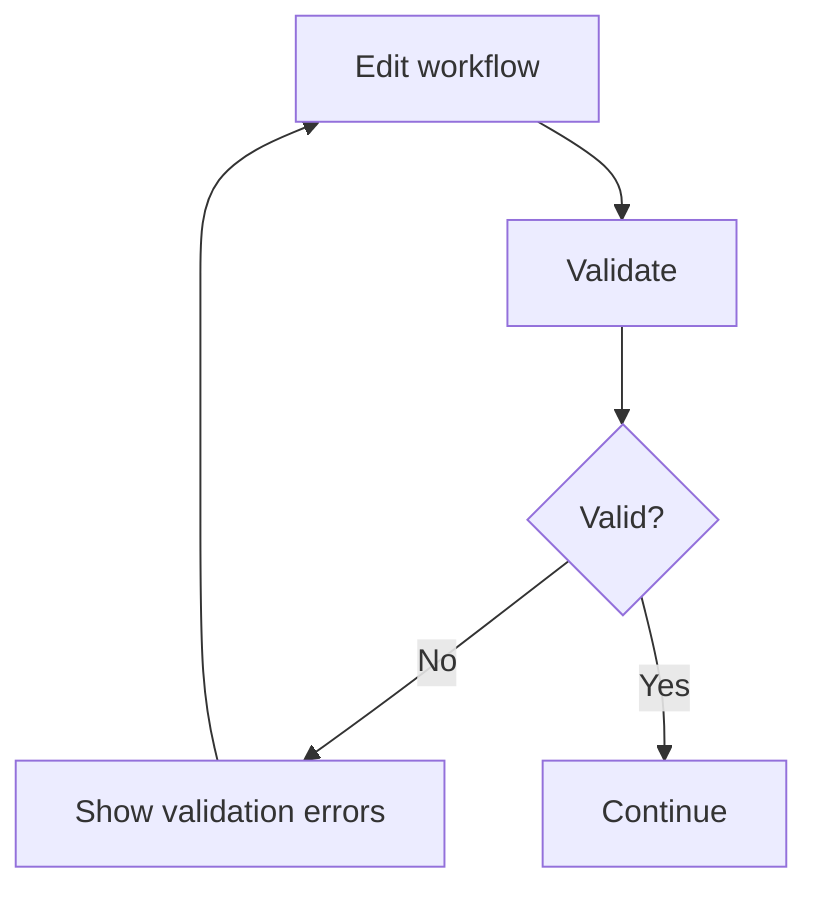
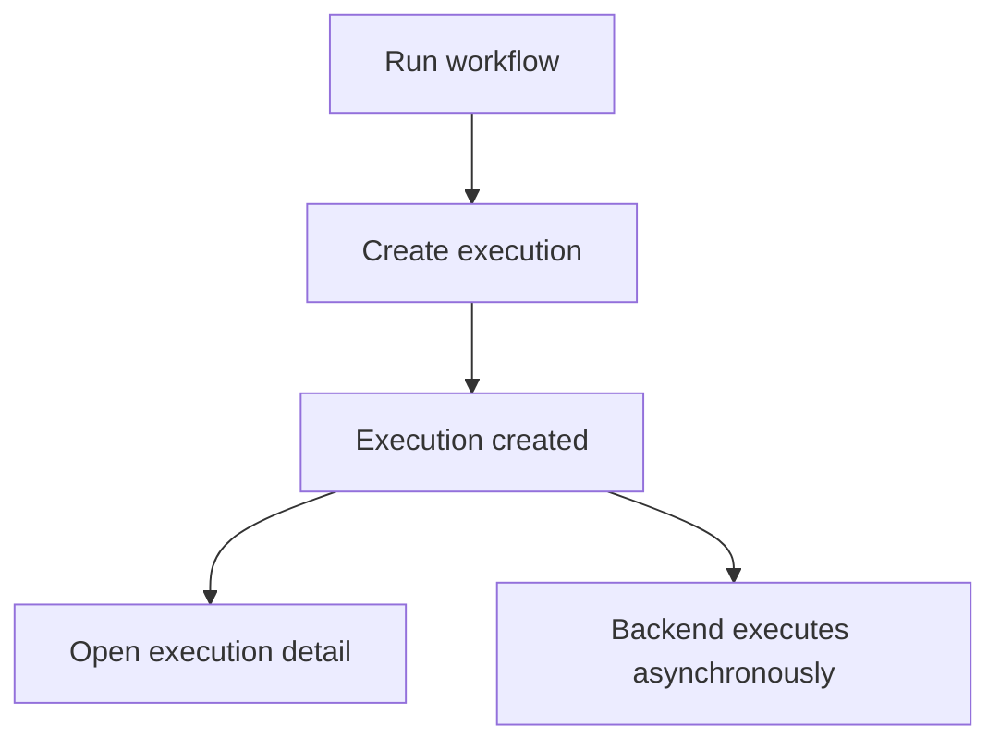

# FlowForge — UX Specification

## 1. UX Philosophy

FlowForge is infrastructure software, but users should not need to understand the underlying infrastructure to use it.

The primary mental model is:

**Project → Workflow → Tasks → Execution**

The UI should hide unnecessary infrastructure complexity while exposing enough execution information for users to understand what happened.

The product should feel like a modern developer tool rather than a generic CRUD dashboard.

---

## 2. Core UX Principles

The interface should prioritize:

- clarity over density
- user intent over system internals
- progressive disclosure
- predictable interactions
- immediate feedback
- graceful failure
- preservation of user work
- accessible interaction
- consistency across screens

The UI should never fabricate backend state or capabilities.

---

## 3. New User Journey

```mermaid
flowchart TD
    Landing --> Signup
    Landing --> Login

    Signup --> Dashboard
    Login --> Dashboard

    Dashboard --> CreateProject
    CreateProject --> Project

    Project --> CreateWorkflow
    CreateWorkflow --> Builder

    Builder --> Validate
    Validate --> Publish

    Publish --> Run
    Run --> Execution

    Execution --> ExecutionResult
````

A new user should be able to understand the basic product flow without reading technical documentation.

---

# 4. Authentication UX

## 4.1 Signup

### Happy path

1. User opens the signup page.
2. User enters required account information.
3. User submits the form.
4. Backend creates the account.
5. User becomes authenticated if supported by the backend.
6. User is redirected into the application.

### Failure behavior

If signup fails:

* remain on the signup page
* display an understandable error
* preserve safe user-entered values
* allow retry

Do not expose sensitive backend details.

---

## 4.2 Login

### Happy path

1. User enters credentials.
2. User submits the form.
3. Backend authenticates the user.
4. Frontend establishes the authenticated state.
5. User is redirected to the application.

### Failure behavior

Display a concise authentication error.

Do not reveal whether a particular account exists unless the backend explicitly provides such behavior.

---

## 4.3 Logout

When the user logs out:

1. authenticated state is cleared
2. protected application state is cleared where appropriate
3. user is redirected to the public authentication entry point

---

# 5. Dashboard UX

The dashboard should immediately answer:

* What projects do I have?
* What workflows exist?
* What have I recently worked with?
* What can I do next?

The dashboard should prioritize meaningful actions over meaningless statistics.

Primary actions may include:

* Create Project
* Open Project
* Create Workflow

Recent activity should only be displayed when backed by actual backend data.

---

# 6. Project UX

## 6.1 Project List

The project list should display:

* project name
* relevant metadata
* navigation action

### Empty state

If the user has no projects:

```text
No projects yet

Create a project to start building workflows.

[Create project]
```

### Loading state

Display a structured skeleton rather than a blank page.

### Error state

Display:

* what failed
* retry action

---

## 6.2 Create Project

The creation flow should be intentionally simple.

1. User selects Create Project.
2. User enters project information.
3. User submits.
4. Backend creates the project.
5. UI reflects the new project.
6. User enters the project workspace where appropriate.

Successful creation should provide concise confirmation.

---

# 7. Workflow UX

A workflow represents a repeatable sequence of tasks.

The user's mental model should be:

```text
Task A → Task B → Task C
```

rather than:

```text
Queue → Worker → Lease → Attempt → Database
```

Infrastructure concepts should only appear when useful for understanding execution.

---

# 8. Workflow Creation

1. User opens a project.
2. User selects Create Workflow.
3. User enters the workflow name.
4. Backend creates the workflow.
5. User is taken to the workflow builder.

The builder should make the next logical action obvious.

---

# 9. Workflow Builder UX

The workflow builder is the primary product surface.

The user should be able to:

* add supported tasks
* configure tasks
* connect tasks
* move tasks
* remove tasks
* validate the workflow
* save the workflow
* publish a version
* run the workflow when supported

The interface should clearly distinguish:

* saved state
* unsaved changes
* published versions
* active versions

---

## 9.1 Unsaved Changes

The builder must visibly indicate when changes have not been persisted.

Example:

```text
Workflow: Transcription Pipeline

● Unsaved changes

[Save]
```

If the user attempts to navigate away with meaningful unsaved work, warn them where practical.

---

# 10. Workflow Validation UX

Validation should be explicit and understandable.



Validation errors should identify the relevant task whenever possible.

Examples:

* missing dependency
* unknown dependency
* dependency cycle
* invalid task configuration
* duplicate task identifier

Errors should be actionable rather than merely technical.

---

# 11. Saving UX

Saving persists the current workflow draft.

### During save

The Save action should show a loading state.

### After successful save

* remove the unsaved indicator
* update persisted state
* provide concise confirmation

Example:

```text
Workflow saved
```

### If save fails

* retain the local draft
* show an actionable error
* allow retry
* do not silently discard changes

---

# 12. Publishing UX

Publishing creates an immutable workflow version.

After publishing:

* show the resulting version
* communicate its publication state
* expose activation where supported

The UI should make the distinction clear:

```text
Draft
↓
Published Version
↓
Active Version
```

The frontend must not imply that publishing and activation are the same operation unless the backend contract explicitly makes them equivalent.

---

# 13. Running a Workflow

The Run action should only be available when the workflow is executable according to backend state.

When the user runs a workflow:



The frontend must not wait for the entire workflow to finish before responding to the Run action.

After execution creation, the user should be taken to execution detail or otherwise given an obvious way to monitor it.

---

# 14. Execution UX

Execution detail should answer:

* Which workflow ran?
* Which version ran?
* What is the current status?
* Which tasks succeeded?
* Which tasks are running?
* Which task failed?
* What result was produced?
* What failure information exists?
* Did recovery or multiple attempts occur?

---

# 15. Execution States

The UI may represent backend-supported states such as:

* pending
* queued
* running
* succeeded
* failed

Additional states may only be displayed if they are actually represented by backend contracts.

Status should be communicated using:

* text
* iconography
* semantic styling

Never rely on color alone.

---

# 16. Execution Refresh

If the backend does not expose real-time events, execution detail may use controlled polling.

Polling should:

* occur only while execution is active
* stop after a terminal state
* avoid excessive requests
* tolerate temporary API failures
* never fabricate progress

The UI should reflect the latest confirmed backend state.

---

# 17. Distributed Recovery UX

The backend supports durable leases, heartbeats, recovery, retries, and stale-worker fencing.

When attempt information is available to the frontend, it should be translated into understandable execution history.

Example:

```text
Transcribe

Attempt 1
Worker A
Worker lost

        ↓

Attempt 2
Worker B
Succeeded
```

The user should understand:

> The first worker stopped before completing the task, so another worker continued execution.

Do not expose:

* lease tokens
* database row identifiers
* internal locking behavior
* raw worker implementation details

unless such information is intentionally exposed as a developer diagnostic feature in a future version.

---

# 18. Failure UX

When execution fails, show:

* overall failed state
* failed task
* failure reason where available
* relevant attempt history where available
* path back to the workflow

Do not make raw stack traces the primary user experience.

If technical error details are available, they may be placed behind a secondary "Details" or "Technical details" interaction.

---

# 19. Empty States

Every collection requires an intentional empty state.

An empty state should answer:

1. What is missing?
2. Why does it matter?
3. What should the user do next?

Example:

```text
No workflows yet

Create your first workflow and turn a sequence
of tasks into a repeatable execution.

[Create workflow]
```

---

# 20. Loading States

Every asynchronous screen requires a deliberate loading state.

Prefer:

* skeletons for page content
* button loading states for mutations
* contextual loading indicators

Avoid replacing an entire application page with an unexplained spinner.

---

# 21. Error States

Errors should communicate:

1. what happened
2. whether the user's work was preserved
3. what they can do next

Example:

```text
Couldn't save workflow

The server could not be reached. Your changes are still
present in the editor.

[Try again]
```

---

# 22. Destructive Actions

Destructive actions require confirmation.

The confirmation should clearly explain:

* what will be deleted or changed
* whether the action is reversible
* what the user should expect afterward

Avoid destructive actions being accidentally triggered by ordinary navigation.

---

# 23. Notifications

Use notifications for meaningful events such as:

* workflow saved
* version published
* workflow activated
* execution started
* operation failed

Do not use notifications for every small UI interaction.

Important errors must also have an in-context representation and must not rely exclusively on a toast.

---

# 24. Responsive UX

Desktop is the primary experience because workflow editing benefits from a large canvas.

Smaller screens must remain usable for:

* viewing projects
* viewing workflows
* viewing executions
* authentication
* basic navigation

The workflow editor may provide a reduced editing experience on mobile rather than attempting to reproduce the entire desktop editor.

---

# 25. Accessibility UX

The UI should support:

* keyboard navigation where practical
* visible focus states
* semantic labels
* accessible form errors
* accessible dialogs
* sufficient contrast
* status communication beyond color
* logical focus movement

After dialogs, validation failures, and major navigation changes, focus should remain understandable to keyboard and assistive-technology users.

---

# 26. V1 UX Boundaries

Do not design or implement user experiences for capabilities that are not part of the current backend/product scope.

Explicitly deferred:

* team collaboration
* role management
* billing
* API key management
* scheduling
* webhooks
* worker administration
* real-time execution event streaming
* AI-generated workflows
* plugin marketplace
* advanced execution logs
* worker management
